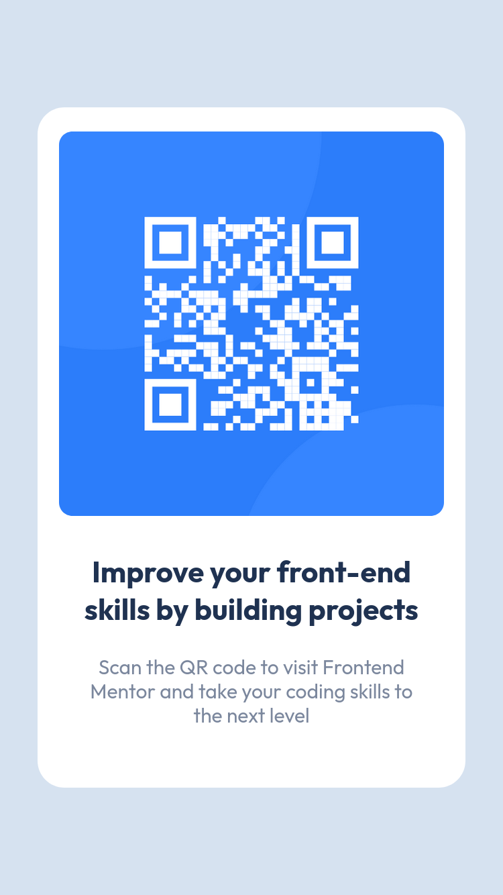
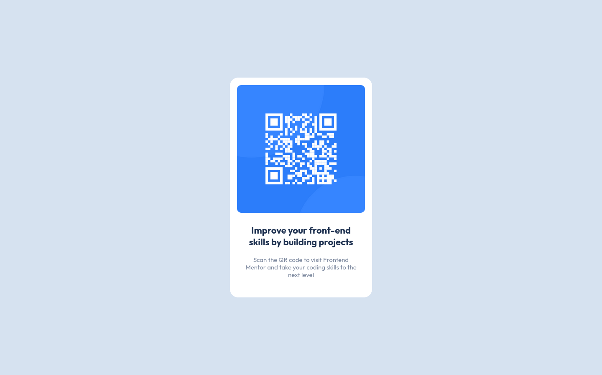

<h1>Qr Code Frontend Mentor Project</h1>

## Mobile 375px

## Desktop 1440px

## Colors

**White**: hsl(0, 0%, 100%)  
**Light gray**: hsl(212, 45%, 89%)  
**Grayish blue**: hsl(220, 15%, 55%)  
**Dark blue**: hsl(218, 44%, 22%)  

## Font Family  

[Outfit](https://fonts.google.com/specimen/Outfit)

Weights: 400 and 700

